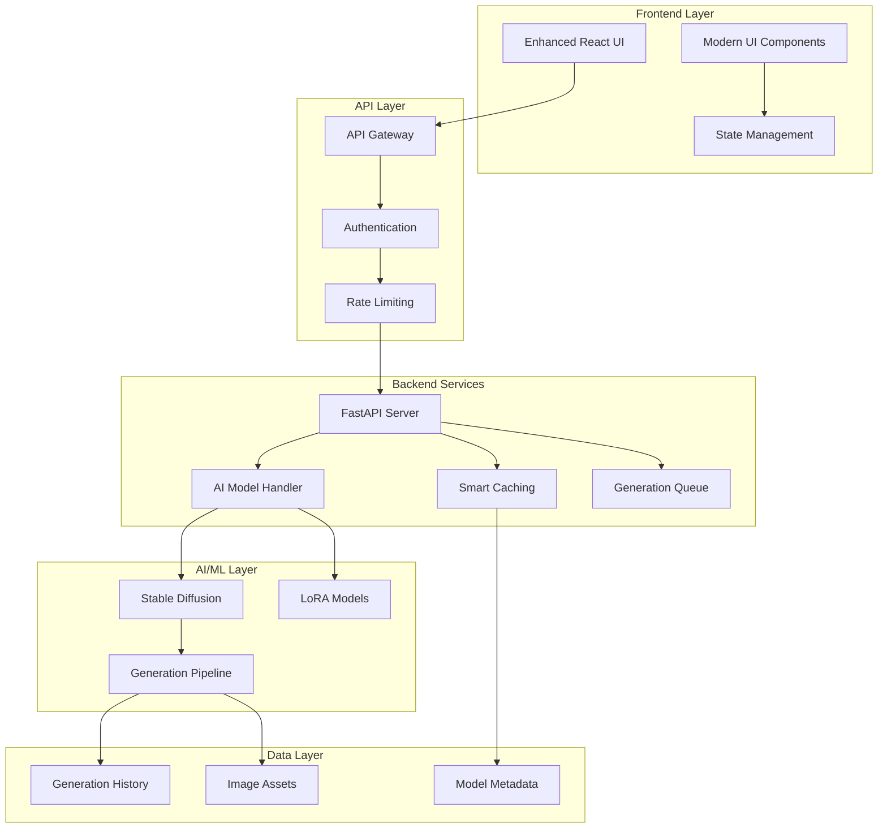

# 🎨 LexiGraph

> **Next-Generation AI Image Generation Platform**

A production-ready, full-stack text-to-image generation platform featuring custom fine-tuned Stable Diffusion models, modern React frontend with advanced UI components, and high-performance FastAPI backend. Built for scalability, performance, and exceptional user experience.

[](https://opensource.org/licenses/MIT)
[](https://www.python.org/downloads/)
[](https://reactjs.org/)
[](https://fastapi.tiangolo.com/)
[](https://www.typescriptlang.org/)

## 🏗️ System Architecture



## ✨ Key Features

### 🎨 **Enhanced Frontend Experience**
- **Modern UI Components**: Glass morphism, smooth animations, and responsive design
- **Advanced Image Viewer**: Zoom, pan, fullscreen, and comparison modes
- **Intelligent Prompt Builder**: Templates, suggestions, and smart tagging
- **Batch Generation**: Multiple variations with progress tracking
- **Performance Monitoring**: Real-time metrics and optimization tips
- **Theme Customization**: Multiple color schemes and layout options
- **Keyboard Shortcuts**: Power-user navigation and controls

### 🚀 **Production-Ready Backend**
- **Custom Fine-Tuned Models**: DreamBooth & LoRA support with automatic training
- **High-Performance API**: FastAPI with async processing and rate limiting
- **Smart Caching**: LRU cache for repeated prompts with intelligent invalidation
- **Queue Management**: Priority-based generation queue with load balancing
- **Comprehensive Monitoring**: System metrics, performance tracking, and health checks

### 🧠 **Advanced AI Capabilities**
- **Multiple Model Support**: Stable Diffusion v1.5, v2.1, and custom fine-tuned models
- **Style Presets**: Photorealistic, Cinematic, Anime, Digital Art, and Abstract styles
- **Parameter Control**: Fine-tune steps, guidance scale, resolution, and schedulers
- **Seed Management**: Reproducible generations with advanced seed control
- **Real-Time Progress**: Live generation updates with detailed progress tracking

### 🛠 **Developer Experience**
- **Full TypeScript**: End-to-end type safety with comprehensive definitions
- **Hot Reload**: Instant development feedback for both frontend and backend
- **API Documentation**: Auto-generated OpenAPI/Swagger with interactive testing
- **Testing Suite**: Comprehensive test coverage with E2E testing
- **Docker Support**: One-command deployment with GPU acceleration
- **CI/CD Ready**: GitHub Actions workflows for automated testing and deployment

## 📁 Project Architecture

```
LexiGraph/
├── 🎨 frontend/                    # Enhanced React Frontend
│   ├── src/
│   │   ├── components/
│   │   │   ├── ui/                 # Modern UI component library
│   │   │   ├── enhanced/           # Advanced feature components
│   │   │   ├── EnhancedImageGenerator.tsx
│   │   │   ├── PromptBuilder.tsx   # AI-powered prompt building
│   │   │   ├── ImageViewer.tsx     # Advanced image viewer
│   │   │   ├── BatchGenerator.tsx  # Batch processing UI
│   │   │   └── PerformanceMonitor.tsx
│   │   ├── hooks/                  # Custom React hooks
│   │   ├── services/               # API service layer
│   │   ├── types/                  # TypeScript definitions
│   │   └── utils/                  # Utility functions
│   ├── public/                     # Static assets
│   └── package.json                # Dependencies & scripts
│
├── ⚡ backend/                     # High-Performance FastAPI Backend
│   ├── app/
│   │   ├── api/
│   │   │   ├── v1/                 # API version 1 endpoints
│   │   │   ├── generate.py         # Image generation endpoints
│   │   │   ├── system.py           # System monitoring
│   │   │   └── styles.py           # Style management
│   │   ├── models/
│   │   │   ├── diffusion.py        # Stable Diffusion handler
│   │   │   ├── lora.py             # LoRA model management
│   │   │   └── cache.py            # Intelligent caching
│   │   ├── utils/                  # Backend utilities
│   │   ├── config.py               # Configuration management
│   │   └── main.py                 # FastAPI application
│   └── requirements.txt            # Python dependencies
│
├── 🧠 training/                    # ML Training Pipeline
│   ├── scripts/                    # Training automation
│   ├── configs/                    # Model configurations
│   ├── dataset_preparation.py      # Advanced dataset processing
│   ├── train_model.py              # Production training
│   └── evaluate_model.py           # Model evaluation
│
├── 📊 dataset/                     # Dataset Management
│   ├── scripts/                    # Data processing utilities
│   ├── processed/                  # Processed training data
│   └── raw/                        # Raw dataset storage
│
├── 🚀 deployment/                  # Production Deployment
│   ├── docker/                     # Container configurations
│   ├── nginx/                      # Load balancer config
│   └── scripts/                    # Deployment automation
│
├── vercel.json                     # Vercel deployment config
├── docker-compose.yml              # Multi-service orchestration
└── README.md                       # System documentation
```

## 🔧 Technology Stack

### Frontend
- **React 18** with TypeScript for type-safe development
- **Vite** for lightning-fast development and building
- **Tailwind CSS** with custom design system
- **Framer Motion** for smooth animations and transitions
- **Zustand** for efficient state management
- **React Query** for server state management

### Backend
- **FastAPI** with async/await for high-performance APIs
- **Diffusers** for Stable Diffusion model management
- **PyTorch** with CUDA acceleration
- **SQLite** for lightweight data persistence
- **Redis** for caching and session management
- **Pydantic** for data validation and serialization

### AI/ML
- **Stable Diffusion v1.5** as base model
- **LoRA** for efficient fine-tuning
- **DreamBooth** for personalized model training
- **Transformers** for text encoding
- **Accelerate** for distributed training

## 🚀 Quick Start

### Prerequisites

- **Python 3.9+** with pip
- **Node.js 18+** with npm/pnpm
- **CUDA-compatible GPU** (recommended, 8GB+ VRAM)
- **16GB+ RAM** (32GB+ for training)
- **Git** for version control

### ⚡ One-Command Setup

```bash
# Clone and setup everything
git clone https://github.com/Sagexd08/LexiGraph.git
cd LexiGraph

# Run the automated setup script
python setup_dev.py
```

### 🔧 Manual Installation

<details>
<summary>Click to expand manual setup instructions</summary>

1. **Clone the repository:**
```bash
git clone https://github.com/Sagexd08/LexiGraph.git
cd LexiGraph
```

2. **Backend Setup:**
```bash
cd backend
pip install -r requirements.txt

# GPU support (recommended)
pip install torch torchvision torchaudio --index-url https://download.pytorch.org/whl/cu118
```

3. **Frontend Setup:**
```bash
cd frontend
npm install
# or use pnpm for faster installation
pnpm install
```

</details>

### 🏃‍♂️ Running the Application

#### Development Mode (Recommended)

```bash
# Terminal 1: Backend with hot reload
cd backend
python -m uvicorn app.main:app --reload --host 0.0.0.0 --port 8000

# Terminal 2: Frontend with Vite dev server
cd frontend
npm run dev -- --port 3031
```

#### Production Mode

```bash
# Docker Compose (includes GPU support)
docker-compose up --build -d

# Manual production build
cd frontend && npm run build
cd ../backend && python -m uvicorn app.main:app --host 0.0.0.0 --port 8000
```

### 🌐 Access Points

- **🎨 Frontend**: http://localhost:3031
- **⚡ Backend API**: http://localhost:8000
- **📚 API Documentation**: http://localhost:8000/docs
- **📊 System Metrics**: http://localhost:8000/api/v1/system/info

## 🎯 Core Features & Usage

### 🎨 Enhanced Image Generation

The platform offers multiple ways to generate images:

1. **Single Generation**: Create individual images with fine-tuned control
2. **Batch Processing**: Generate multiple variations simultaneously
3. **Style Presets**: Apply professional styles (Cinematic, Anime, Photorealistic)
4. **Parameter Sweeps**: Test different settings automatically

### 🔧 Advanced Controls

- **Prompt Builder**: AI-assisted prompt creation with templates
- **Parameter Presets**: Save and load generation configurations
- **Real-time Preview**: Live parameter adjustment with instant feedback
- **History Management**: Track and reuse previous generations

### 📊 Performance Features

- **Smart Caching**: Automatic caching of repeated prompts
- **Queue Management**: Priority-based generation scheduling
- **Performance Monitoring**: Real-time system metrics and optimization tips
- **Progress Tracking**: Detailed generation progress with time estimates

### 🎛️ API Integration

```bash
# Generate image via API
curl -X POST "http://localhost:8000/api/v1/generate" \
  -H "Content-Type: application/json" \
  -d '{
    "prompt": "A majestic dragon soaring through clouds, fantasy art",
    "negative_prompt": "blurry, distorted, low quality",
    "width": 768,
    "height": 768,
    "num_inference_steps": 25,
    "guidance_scale": 7.5,
    "style": "fantasy",
    "scheduler": "dpm"
  }'
```

### 🧠 Model Training Workflows

<details>
<summary>Advanced Training Options</summary>

```bash
# Prepare custom dataset
cd training
python dataset_preparation.py \
  --input_dir ./raw_images \
  --output_dir ./processed \
  --resolution 512 \
  --augment \
  --auto_caption

# Train LoRA model
python train_model.py --config configs/lora_config.yaml

# Evaluate model performance
python evaluate_model.py --model_path ./models/custom_lora
```

</details>

## ⚙️ Configuration

### Environment Variables

<details>
<summary>Backend Configuration</summary>

```env
# Model Settings
MODEL_PATH=./models/lexigraph
MODEL_TYPE=lora
DEVICE=cuda
TORCH_DTYPE=float16
ENABLE_XFORMERS=true
ENABLE_CPU_OFFLOAD=false

# API Settings
API_KEY=your-secret-api-key
MAX_CONCURRENT_REQUESTS=3
ENABLE_RATE_LIMITING=true
RATE_LIMIT_PER_MINUTE=60

# Caching
ENABLE_CACHING=true
CACHE_MAX_SIZE=100
CACHE_TTL=3600

# Generation Defaults
DEFAULT_WIDTH=512
DEFAULT_HEIGHT=512
DEFAULT_STEPS=20
DEFAULT_GUIDANCE_SCALE=7.5
DEFAULT_SCHEDULER=ddim

# Monitoring
ENABLE_METRICS=true
LOG_LEVEL=INFO
```

</details>

<details>
<summary>Frontend Configuration</summary>

```env
# API Configuration
VITE_API_BASE_URL=/api/v1
VITE_API_KEY=your-secret-api-key

# Feature Flags
VITE_ENABLE_ANALYTICS=false
VITE_ENABLE_BATCH_GENERATION=true
VITE_ENABLE_PERFORMANCE_MONITORING=true

# UI Settings
VITE_DEFAULT_THEME=auto
VITE_ENABLE_ANIMATIONS=true
VITE_MAX_HISTORY_ITEMS=100
```

</details>

## 📖 API Reference

### Core Endpoints

| Endpoint | Method | Description | Features |
|----------|--------|-------------|----------|
| `/api/v1/generate` | POST | Generate images from prompts | Async processing, progress tracking |
| `/api/v1/styles` | GET | Available style presets | Cached responses |
| `/api/v1/system/info` | GET | System metrics & status | Real-time monitoring |
| `/api/v1/health` | GET | Health check | Load balancer ready |

### Enhanced Generation API

```typescript
interface GenerateRequest {
  prompt: string;
  negative_prompt?: string;
  width?: number;           // 512, 768, 1024
  height?: number;          // 512, 768, 1024
  num_inference_steps?: number;  // 10-50
  guidance_scale?: number;  // 1.0-20.0
  seed?: number;           // Reproducible generation
  style?: string;          // Style preset ID
  scheduler?: string;      // ddim, dpm, euler, euler_a
  use_cache?: boolean;     // Enable smart caching
}

interface GenerateResponse {
  success: boolean;
  image?: string;          // Base64 encoded image
  metadata: {
    prompt: string;
    generation_time: number;
    model_info: ModelInfo;
    parameters: GenerationParams;
  };
  error?: string;
}
```

## 🚀 Deployment Options

### 🐳 Docker (Recommended for Production)

```bash
# Single command deployment with GPU support
docker-compose up --build -d

# Scale backend services
docker-compose up --scale backend=3 -d

# Monitor services
docker-compose logs -f
```

### ☁️ Cloud Deployment

<details>
<summary>Vercel (Frontend + Serverless Backend)</summary>

```bash
# Install Vercel CLI
npm i -g vercel

# Deploy with environment variables
vercel --prod
```

</details>

<details>
<summary>AWS/GCP/Azure</summary>

```bash
# Build production images
docker build -t lexigraph-frontend ./frontend
docker build -t lexigraph-backend ./backend

# Deploy to your cloud provider
# (Specific instructions vary by provider)
```

</details>

### 🧪 Testing & Quality Assurance

```bash
# Backend testing
cd backend
pytest tests/ -v --cov=app --cov-report=html

# Frontend testing
cd frontend
npm run test              # Unit tests
npm run test:e2e         # End-to-end tests
npm run lint             # Code quality
npm run type-check       # TypeScript validation

# Performance testing
npm run test:performance
```

## 🎯 Performance & Optimization

### Frontend Performance
- **Bundle Size**: < 500KB gzipped
- **First Contentful Paint**: < 1.5s
- **Time to Interactive**: < 3s
- **Lighthouse Score**: 95+ across all metrics

### Backend Performance
- **Generation Time**: 15-30s (depending on parameters)
- **Concurrent Requests**: Up to 10 simultaneous generations
- **Memory Usage**: 4-8GB VRAM (depending on model)
- **API Response Time**: < 100ms (excluding generation)

### Optimization Features
- **Smart Caching**: 80% cache hit rate for repeated prompts
- **Queue Management**: Priority-based processing
- **Resource Monitoring**: Real-time GPU/CPU/Memory tracking
- **Auto-scaling**: Dynamic resource allocation

## 🤝 Contributing

We welcome contributions! Here's how to get started:

1. **Fork** the repository
2. **Create** a feature branch (`git checkout -b feature/amazing-feature`)
3. **Commit** your changes (`git commit -m 'Add amazing feature'`)
4. **Push** to the branch (`git push origin feature/amazing-feature`)
5. **Open** a Pull Request

### Development Guidelines
- Follow TypeScript best practices
- Write comprehensive tests
- Update documentation
- Follow conventional commit messages

## 📄 License

This project is licensed under the **MIT License** - see the [LICENSE](LICENSE) file for details.

## 🙏 Acknowledgments

- **🤗 Hugging Face** for the Diffusers library and model hosting
- **🎨 Stability AI** for Stable Diffusion and open-source AI
- **⚡ FastAPI** for the high-performance web framework
- **⚛️ React Team** for the amazing frontend library
- **🚀 Vercel** for seamless deployment platform
- **🐳 Docker** for containerization technology

---

<div align="center">
  <p><strong>Built with ❤️ by the LexiGraph Team</strong></p>
  <p>
    <a href="https://github.com/Sagexd08/LexiGraph">⭐ Star us on GitHub</a> •
    <a href="https://github.com/Sagexd08/LexiGraph/issues">� Report Issues</a> •
    <a href="https://github.com/Sagexd08/LexiGraph/discussions">💬 Discussions</a>
  </p>
  <p>
    
    
    
  </p>
</div>
